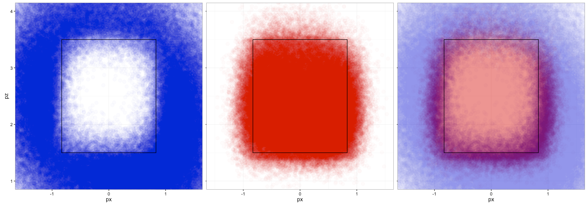

```{r setup, include=FALSE}
knitr::opts_chunk$set(echo = FALSE)
```


----




## Assumptions/Motivations

> - Consistency is more important than conformity.
> - A consistent zone need not be rectangular, but should be convex.
> - Consistency *within* a game is important.
> - Different zones for LH and RH batters are OK.
> - One egregiously bad call is worse/as bad as several marginally bad calls.

## The Established Strike Zone is the Convex Hull

## The Established Ball Zone is the $\alpha$-Hull

## Tuning $\alpha$


## Correlations
```{r, comment=NA,echo=2}
umpMetrics <- readRDS("metricsforslides.Rda")
round(cor(umpMetrics),2)
```


## Overlap vs. Inconsistency Index ($r=0.86$)


## Accuracy vs. Inconsistency ($r=-0.55$)


## Accuracy vs. Inconsistency ($r=-0.65$)
