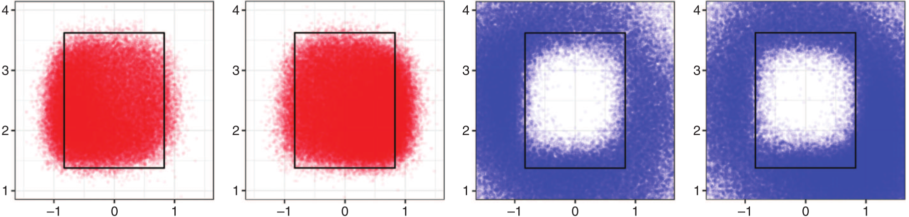
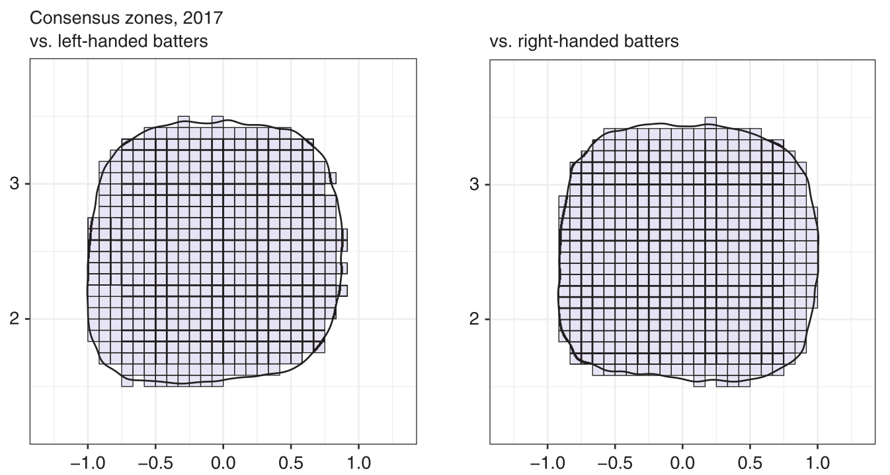
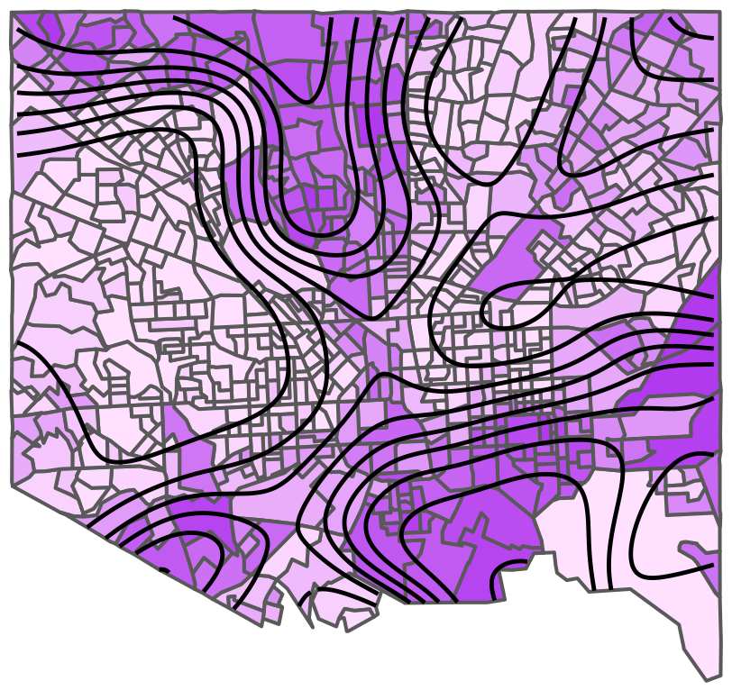
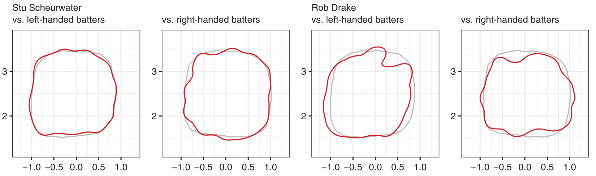
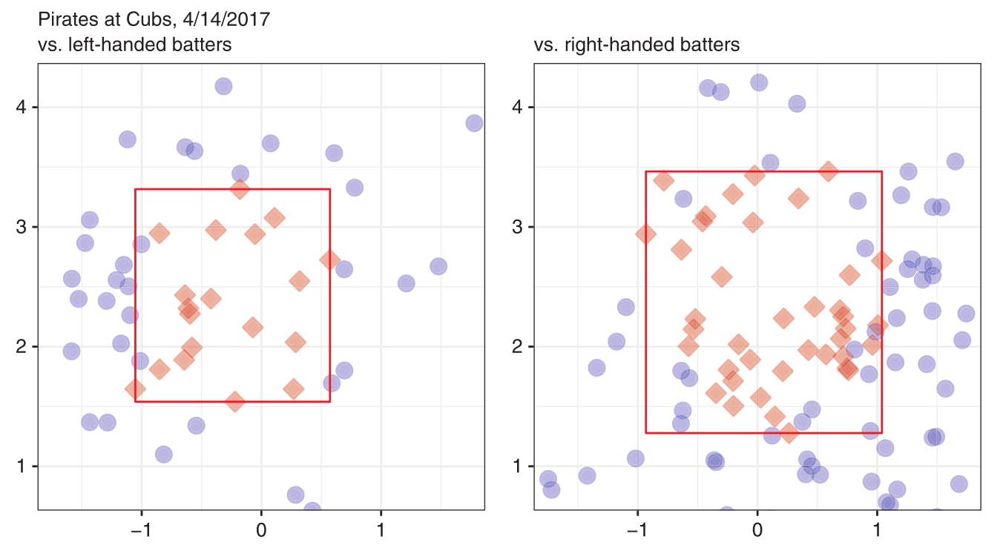
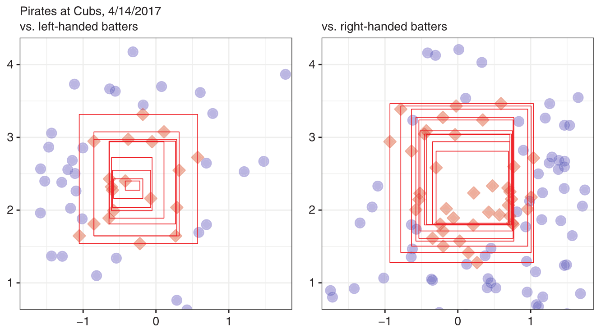
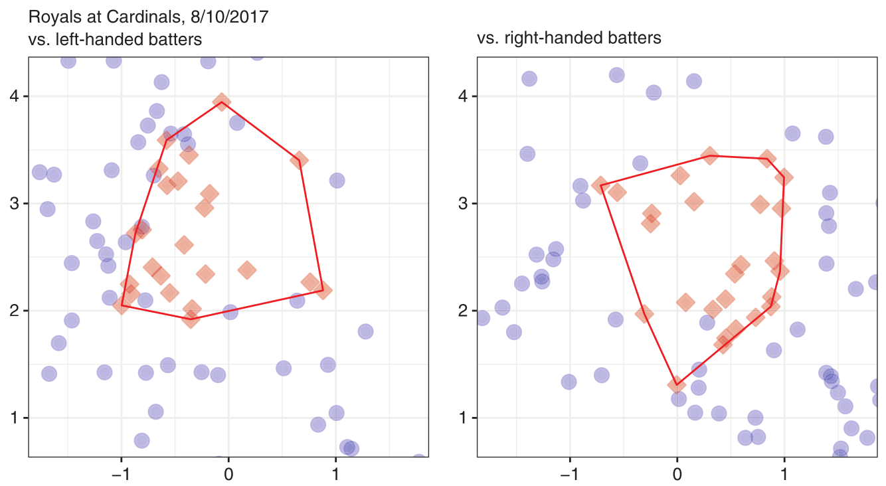
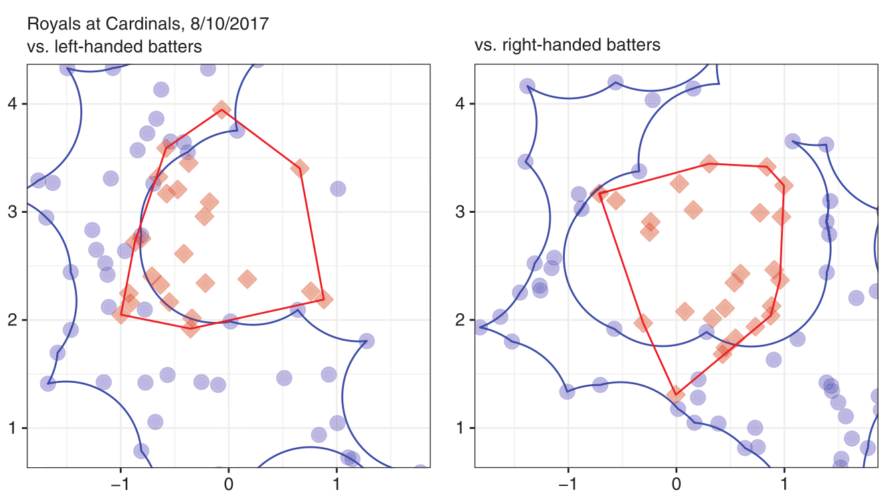
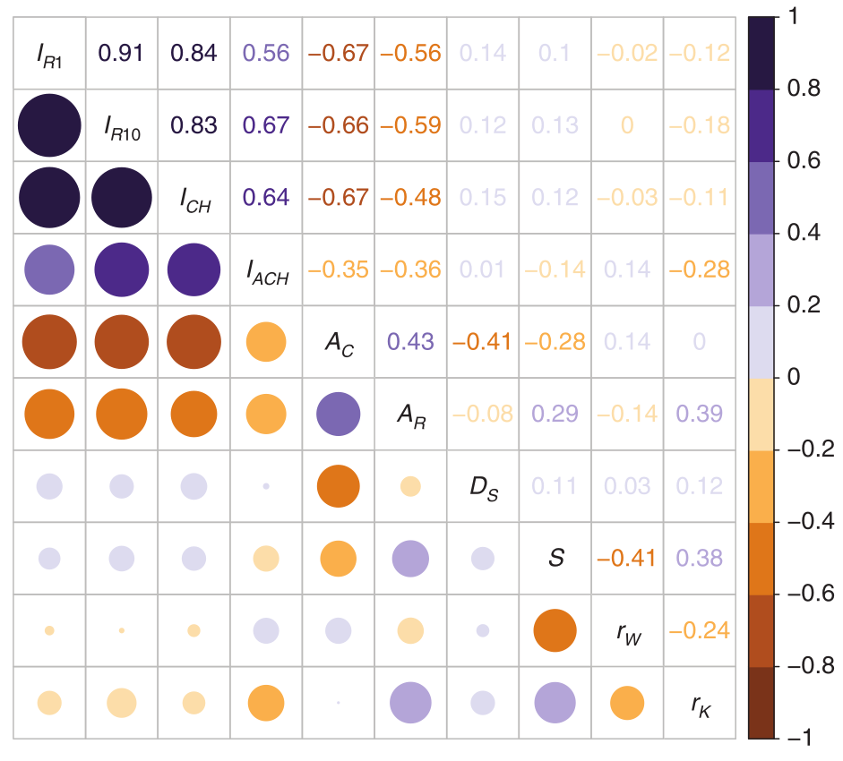

# Introduction

## These slides are available online

HTML Slides and related information can be found at: https://djhunter.github.io/inconsistency/

##  {data-background="allpitches.png" data-background-size="contain"}

## Consistency vs. Accuracy

- "Rulebook" Zone: Rectangle (not actually).
- "Consensus" Zone: What historically has been enforced.
    - Rounded corners
    - Different for Left/Right batters
- *Consistency* more important (as important) as fidelity to rectangle?
    - How should umpires be evaluated?
    - How should the robots be tuned?

```{r echo=FALSE, fig.align='center', out.width='100%'}

```

# Measuring Accuracy

## What shape is the strike zone?

- *Rulebook (definition):* A right pentagonal prism over home plate.
    - Bottom and top depend on height of batter.
    - Strike if any part of the ball passes through any part of the zone.
- *Proxy rulebook:* The rectangular front of the rulebook zone.
- *Rulebook (judgment):* "... legal pitch when so called by the umpire."
- *Consensus:* The planar region above the front of the plate that has historically been called.
    - Different for left/right hand batters.
    - Varies from year to year.
    - Rounded (perhaps to account for "backdoor" strikes?)
    
## Consensus zone by kernel density estimation {data-transition="slide-in fade-out"}

- **Not** a spray chart. 
- Border should be curve where ball and strike are equally-likely to be called.

Let $s(x,y)$ be the two-dimensional PDF describing the distribution of called strikes in the plane (i.e., $s(x,y)$ gives the density of the probability
that a called pitch will cross the plate at location $(x,y)$, given that the pitch is called a strike). Compute a KDE $\hat{s}(x,y)$ using all 2017 called strikes, and another KDE  $\hat{c}(x,y)$ for all called pitches. Then by Bayes' theorem, 
$$
\hat{f}(x,y) = \frac{\hat{p} \cdot \hat{s}(x,y)}{\hat{c}(x,y)},
$$
where $\hat{p}$ is the proportion of called pitches that are strikes. The 50\% contour of $\hat{f}(x,y)$ will then be the border of the consensus zone.

## Consensus zone by kernel density estimation {data-transition="fade-in slide-out"}

- **Not** a spray chart. 
- Border should be curve where ball and strike are *equally-likely* to be called.

Let $s(x,y)$ be the two-dimensional PDF describing the distribution of called strikes in the plane (i.e., $s(x,y)$ gives the density of the probability
that a called pitch will cross the plate at location $(x,y)$, given that the pitch is called a strike). Compute a KDE $\hat{s}(x,y)$ using all 2017 called strikes, and another KDE  $\hat{c}(x,y)$ for all called pitches. Then by Bayes' theorem, 
$$
\hat{f}(x,y) = \frac{\hat{p} \cdot \hat{s}(x,y)}{\hat{c}(x,y)},
$$
where $\hat{p}$ is the proportion of called pitches that are strikes. The *50\% contour* of $\hat{f}(x,y)$ will then be the border of the consensus zone.

## Consensus zones and choropleth maps

- Example [Roegele]. Shaded squares are where probability of a strike call is greater than 50%.
- 50\% contour of $\hat{f}(x,y)$ gives a smooth estimate.

```{r echo=FALSE, fig.align='center', out.width='70%'}

```

## Application to segregation measures

- $y = \hat{f}(x,y)$ is a surface, and $\nabla \hat{f}$ can measure the extent of segregation.
- *Segregation Surfaces*, Hunter/Warioba, Mathematics Magazine, to appear.

```{r echo=FALSE, fig.align='center', out.width='50%'}

```

## Umpire accuracy

- Using the proxy rulebook zone (rectangle), the best umpires are about 91% accurate.
- Using the consensus zone, the best umpires are about 95% accurate.
- Measured on all umpires, the two accuracy measurements are not strongly correlated ($r \approx 0.4$)

## Umpire tendencies

- Compute 50% contours of $\hat{f}$ for individual umpires.
- Can compute area (zone size), and observe shape differences.
- Symmetric difference with consensus zone measures conformity.

```{r echo=FALSE, fig.align='center', out.width='100%'}

```


# Measuring Inconsistency

## Assumptions

- Over the course of a game, umpires *establish* a strike zone.
    - Should be consistent.
    - Should be a rectangle?
    - Or just convex?

## One-rectangle inconsistency index

- *Established strike zone:* The smallest rectangle containing all the strikes.
- Balls in the established strike zone are inconsistent.
- $I_{R1} = \frac{\text{number of inconsistent balls}}{\text{total number of called balls}} = \frac{2+13}{110} \approx 0.136$

```{r echo=FALSE, fig.align='center', out.width='70%'}

```

## Problems with $I_{R10}$

- Very sensitive to a single outlying strike.
    - e.g., lowest strike on right: removing eliminates 3 inconsistent balls.
- Fails to account for multiple bad strike calls in the same location.
    - e.g., leftmost strike has no effect.
    
```{r echo=FALSE, fig.align='center', out.width='65%'}

```

## $n$-rectangle inconsistency index

- First rectangle: bounded by largest/smallest $x$ and $y$ values. (same as $I_{R1}$) 
- $n$th rectangle: bounded by the $n$-th largest/smallest $x$ and $y$ values.
- Count number $s(i)$ of called balls inside rectangles.
- $I_{Rn} = \frac{s(1) + s(2) + \cdots + s(n)}{\text{total number of called balls}}$
- Usually $n = 10$ is plenty.

```{r echo=FALSE, fig.align='center', out.width='50%'}

```

## $n$-rectangle inconsistency index: Example

$$
I_{R10} = \frac{(2+13)+(0+10)+(0+6)+(0+1)}{110} \approx 0.29.
$$

```{r echo=FALSE, fig.align='center', out.width='70%'}

```

## Convex-hull inconsistency index

- Established strike zone: *Convex hull* of strikes.
- Balls in the established strike zone are inconsistent.
- $I_{CH} = \frac{\text{number of inconsistent balls}}{\text{total number of called balls}} = \frac{5+1}{118} \approx 0.051$
- Similar limitations as $I_{R1}$

```{r echo=FALSE, fig.align='center', out.width='60%'}

```

## $\alpha$-convex hull inconsistency index

- Called-ball region: *alpha-convex hull* of balls. [Rodríguez-Casal]
- "Punch out" circles of some chosen radius $\alpha$ (we'll use $\alpha = 0.7$).
- $I_{ACH} = \frac{n_La_L + n_Ra_R}{n_L+n_R}$, where $a_L$ and $a_R$ are the areas of the overlap.

```{r echo=FALSE, fig.align='center', out.width='70%'}

```


# Some conclusions

## Correlations of measures on 2017 umpires

<div class="column-left">
- Inconsistency measures: $I_{R1}$, $I_{R10}$, $I_{CH}$, $I_{ACH}$
- Accuracy measures: $A_C$, $A_R$
- Symmetric difference with consensus zone $D_S$
- Zone size $S$
- Strikeout and walk rate $r_K$, $r_W$
</div>

<div class="column-right">
```{r echo=FALSE, fig.align='center', out.width='100%'}

```
</div>

## {data-background="umpscattercor.png"  data-background-size="contain"}

## Principal component analysis

- Run `prcomp()` on $I_{R1}$, $I_{R10}$, $I_{CH}$, $I_{ACH}$, $A_C$, $A_R$, $D_S$, $S$, $r_K$, $r_W$.
- First two components PC1 and PC2 account for 68% of variation.
- PC1 dominated by accuracy measures (positive) and inconsistency measures (negative).
    - *Strike zone quality*
- PC2 dominated by walk rate (negative) and strikeout rate and zone size (positive).
    - *Pitcher friendliness*

## {data-background="umpscatterpca.png" data-background-size="contain"}

## Data and source code

For reproducibility, data and R code used for the analysis and figures in this paper are available at:
https://github.com/djhunter/inconsistency


